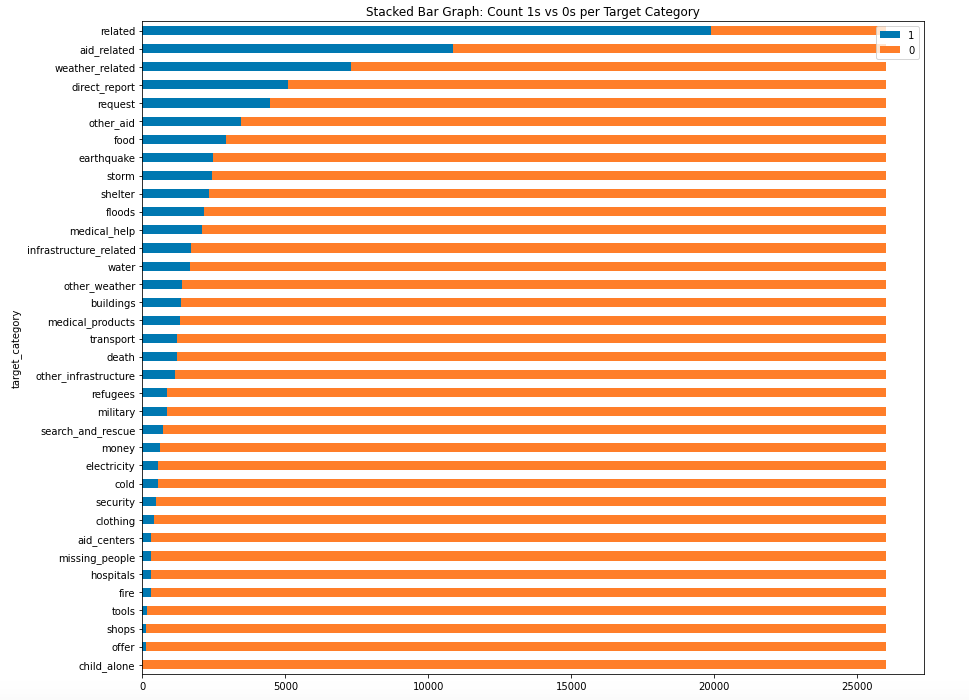
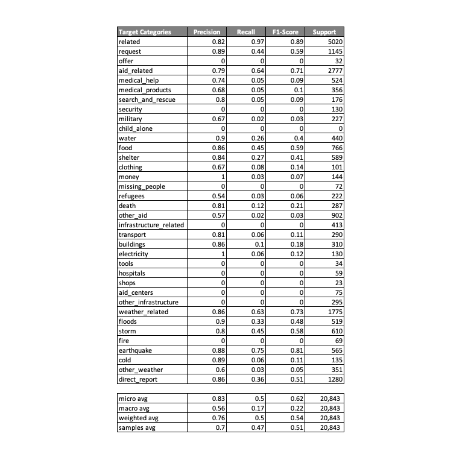

# Disaster Response Pipeline Project

## Objective

> We are analyzing emergency text messages to create a multioutput classifier to predict multiple target variables 
> (binary categories) for each input message. There are total of 36 target categories and for every message the model 
> will predict how many relevant categories are applicable. Essentially, we are using natural language processing 
> methods to create features to predict which 36 target categories have the highest probabilities of success and 
> generate a multioutput response for every input message.
> 
> If a successful model is created, various government agencies and private organizations can quickly identify
> different types of emergencies and rapidly allocate resources. With acceptable precision and recall, the model can 
> minimize wasteful spending and increase efficiency among first-responders to assist the public.

## Pickled Model

* `nlp_multi_classifier.pkl`: The original size of the pickled model was too large to push to Github.
* Follow the steps under [Instructions](#instructions) to generate the model and run the web app.

## Core Files 

* `data/process_data.py`: Read CSV files, merge files, and load data into database.
  * data/disaster_categories.csv
  * data/disaster_messages.csv
* `models/train_classifier.py`: Access data from database, conduct feature engineering, train model, and save model.
* `app/run.py`: Run web app and pull necessary resources from .py and .html files.
* `go.html`: Renders html template with the resultset where the input comes from web app input bar.
* `master.html`: Renders main html template when app is up and running.


## Feature Engineering Details

* Step 1: Tokenization of text 
  * First, remove stop words, symbols, punctuations, and unwanted patterns from text. 
  * Next, we tokenized the text which involves breaking sentences into words.
  * Tokenized text is further cleaned by lemmatizing the tokens.
  * Lastly, a list of cleaned tokens is created.

* Step 2: TF-IDF (Term Frequency - Inverse Document Frequency)
  * Quick definition from Wikipedia: "In information retrieval, tf–idf, TF*IDF, or TFIDF, short for term frequency–inverse document frequency, is a numerical statistic that is intended to reflect how important a word is to a document in a collection or corpus."
  * Sklearn's TfidfTransformer class is doing all the heavy lifting in this part. 
  * In essence, we are creating a numeric measure or feature to assess word importance within a collection of documents.

* Step 3: Starting Verb Extraction
  * This is a custom class leveraging Sklearn's base classes, BaseEstimator and TransformerMixin.
  * This class extracts the starting verb in every message or sentence. 
  * This is another engineered feature used to train the classifier.


## Pipeline Details

1. Feature Engineering
   * Tokenize text using Sklearn's CountVectorizer and custome tokenize function.
   * Leverage Sklearn's TfidfTransformer to generate TF-IDF numeric feature.
   * Leverage Sklearn's base classes to create custome tranformer class, StartingVerbExtractor, to identify verbs in text.
2. Model Training
   * Leverage Sklearn's MultiOutputClassifier and RandomForestClassifier to train model. 
   * Take processed and engineered text numeric features and train against multiple target variables (36 target variables/categories).
   * Additionally, a handful of hyperparameters are tuned using Sklearn's GridSearchCV, which helps to further optimize the model.

```python
def build_train_model(X_train, y_train):
    """
    Function is wrapped around Sklearn's Pipeline object. Pipeline object is designed to stack various data
    transformation and model training layers to output a trained classifier. Sklearn's GridSearchCV is
    used to tune the hyper-parameters to further tune the model during training.

        Parameters:
            X_train (pd.DataFrame): train data
            y_train (pd.DataFrame): train multiple target variables

        Returns:
            model (object): Fitted and tuned multioutput classifier pipeline object
    """

    pipeline = Pipeline([
        ('features', FeatureUnion([

            ('text_pipeline', Pipeline([
                ('count_vectorizer', CountVectorizer(tokenizer = tokenize)),
                ('tfidf_transformer', TfidfTransformer())
            ])),

            ('starting_verb', StartingVerbExtractor())
        ])),

        ('clf', MultiOutputClassifier(RandomForestClassifier()))
    ])

    parameters = {
        'features__text_pipeline__count_vectorizer__max_df': (0.5, 0.75, 1.0),
        'clf__estimator__min_samples_split': [2, 3, 4],
    }
    model = GridSearchCV(pipeline, param_grid=parameters, n_jobs=-1, verbose=5)
    model.fit(X_train, y_train)
    return model
```

## Results

* To assess model performance, we looked at precision, recall, f1-score, and support. Every target category has four performance metrics.
  * Leveraged Sklearn's [classification_report](https://scikit-learn.org/stable/modules/generated/sklearn.metrics.classification_report.html) function.
  * Based on these metrics, you can determine the shortcomings of the model.
  * For example, target categories like "security", "child_alone", "missing_people", "shope", and "fire" are all zeros or close to zero.
  * Due to lack of training data as well as lack of relevant features, model performance is skewed towards certain target categories.
  * As the stack bar graph shows, many of the target variables suffer from class imbalance and thus contributing to relatively lower predictive power.



* Precision is the ratio tp / (tp + fp) where tp is the number of true positives and fp the number of false positives. The precision is intuitively the ability of the classifier not to label as positive a sample that is negative.
* Recall is the ratio tp / (tp + fn) where tp is the number of true positives and fn the number of false negatives. The recall is intuitively the ability of the classifier to find all the positive samples.
* F-beta score can be interpreted as a weighted harmonic mean of the precision and recall, where an F-beta score reaches its best value at 1 and worst score at 0. The F-beta score weights recall more than precision by a factor of beta. beta == 1.0 means recall and precision are equally important.
* Support is the number of occurrences of each class in y_true.




## Instructions

1. Run the following commands in the project's root directory to set up your database and model.

    - To run ETL pipeline that cleans data and stores in database
        `python data/process_data.py data/disaster_messages.csv data/disaster_categories.csv UdacityDisasterResponse.db`
    - To run ML pipeline that trains classifier and saves
        `python models/train_classifier.py UdacityDisasterResponse.db nlp_multi_classifier.pkl`

2. Run the following command in the app's directory to run your web app.
    `python run.py`

3. Go to http://0.0.0.0:3001/


## References

* [ETL Pipeline Preparation (Jupyter Notebook)](https://github.com/do-y-lee/ml-disaster-response-pipeline-demo/blob/main/ETL%20Pipeline%20Preparation.ipynb)
* [ML Pipeline Preparation (Jupyter Notebook)](https://github.com/do-y-lee/ml-disaster-response-pipeline-demo/blob/main/ML%20Pipeline%20Preparation.ipynb)
* [TF-IDF Practice (Jupyter Notebook)](https://github.com/do-y-lee/ml-disaster-response-pipeline-demo/blob/main/bow_tfidf_practice.ipynb)


## Appendix: Conda Shortcuts

* Create environment.yml file via conda  with your conda environment activated, run the following command to generate dependency yaml file:
  * ```conda env export > environment_droplet.yml```
* Create a conda environment:
  * ```conda env create -f environment.yml```
* List all the conda environment available:
  * ```conda info --envs```  
* Create new environment named as `envname`:
  * ```conda create --name envname```
* Remove environment and its dependencies:
  * ```conda remove --name envname --all```
* Clone an existing environment:
  * ```conda create --name clone_envname --clone envname```
  